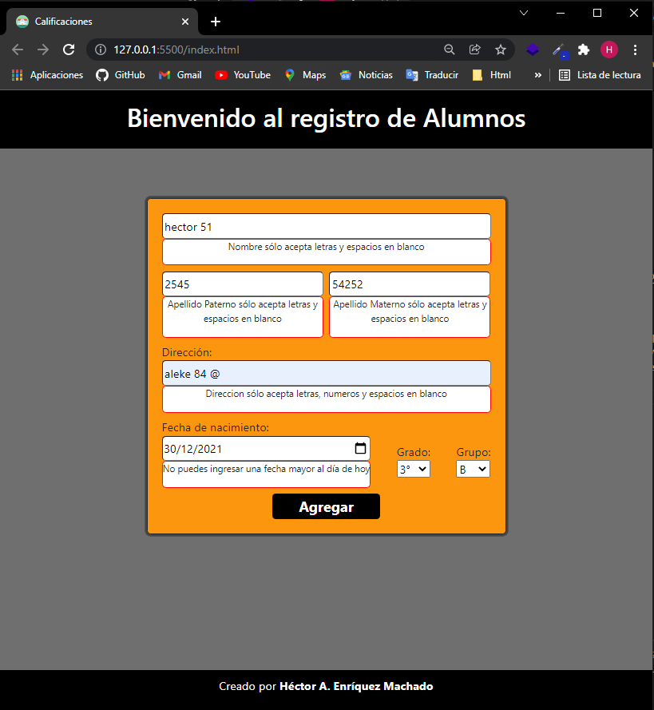
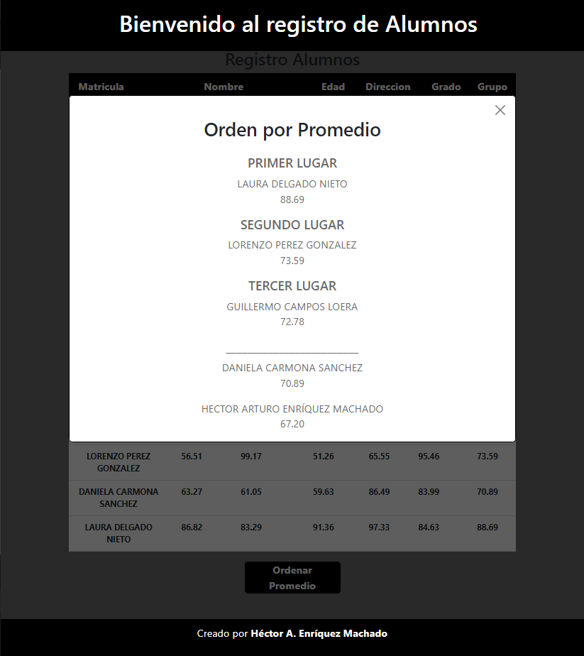

# Proyecto Gestor de Calificaciones

### Creado por: **Héctor A. Enríquez Machado**

### Bases:

- La entrega de este sistema debe ser el 10 de Enero del 2022 (si puede ser antes mejor).
- Deben usar todos o la mayoría de los métodos vistos en clase.
- Es válido investigar e incluir funcionalidad no vista en clase, pero explicando que se está realizando en el código.
- Al final de realizado este sistema deben incluir a detalle que hicieron, el porque lo hicieron así y que dificultades tuvieron en que partes del código.

## Presentación del Proyecto 

El proyecto de gestor de calificaciones, el primer paso fue leer las bases y la descripción del proyecto, en base a eso y el hecho que se podía presentar con un archivo html y css para mostrar la funcionalidad que le daríamos con javascript, decidí crear una interfaz para que pudiera tener interacción con el usuario.  
En este proyecto decidí ocupar algunos conocimientos que tengo sobre el lenguaje mas sin embargo no los había ocupado, y este proyecto me sirvió mucho para ejecutar funciones, al darle uso, en los archivos js del repositorio estarán los comentarios y explicaciones de las funciones que ocupe, aquí mostrare la interfaz y como es la ejecución de la aplicación.  
Uno de lo complicado en escribir el código de la misma, fue que es una aplicación síncrona que hace un paso hasta que se cumplan las demás condiciones o funciones, al final de la aplicación se me complicaba realizar todo el procedimiento para ver como funcionaba las funciones que se iban agregando.
En el proyecto utilice un archivo html, Bootstrap, Sass, js e importación de modulos.

##

## Interfaz

Presentación de la interfaz, en donde se solicitaran los siguientes datos.
- Nombre.
- Apellido Paterno.
- Apellido Materno.
- Dirección de calle y numero.
- Fecha de Nacimiento.
- Grado.
- Grupo.

## Validación input vacios

Decidí incluir una validación que no permita agregar esos datos si los input estan vacios, y se desactiva el boton hasta que los datos sean ingresados.

## Validación datos

En esta ocacion la validación se basa en los datos que introduce el usuario sean permitidos para la funcion que tiene cada input y para el objetivo del cual se piden los valores.

- Nombre, Apellido paterno y Apellido materno.
    - Solo aceptan letras y espacios vacios.
- Dirección.
    - Solo acepta letras, espacios y numeros. Ningun caracter especial.
- Fecha de nacimiento.
    - Valida que no se ingrese una fecha posterior al día actual.

## Ejecición Aplicación

### 1.- Paso - Agregando alumnos

Ingreso de datos validos.

### 2.- Paso - Agregando tabla 

Se agrega tabla con los datos ingresados, generando una matricula unica y existe una funcion que calcula la edad de la fecha de nacimiento. El boton de agregar sigue en funcion para seguir agregando registros.

### 3.- Paso - Agregando tabla de Calificaciones 

Al precionar el boton Ver calificaciones, se agrega una segunda tabla con los nombres de los alumnos que se agregaron con sus respectivas calificaciones de cada materia, y al final se calcula el promedio de cada alumno.

### 4.- Paso - Podio de promedios. 

Al precionar el boton Ordenar promedio se abre una ventana la cual ordena las posiciones del primer lugar, segundo lugar, tercer lugar y despues los siguientes por el promedio general.
 
 
Cuando se presiona el boton con la x la aplicación se restablece para agregar nuevos datos

#
## Concluciones

En general me sirvio mucho este proyecto para desarrollar los conocimientos previos, y tambien la investigación que hice para realizar ciertas funciones como por ejemplo el calcular la edad, funciones para acomodar de mayor a menor etc. Creo que podría ir mejorando el codigo para optimizarlo pero en general me siento satisfecho porque se cumplio lo estabecido en este proyecto.

